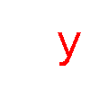
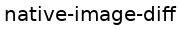
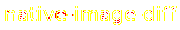
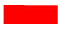
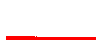
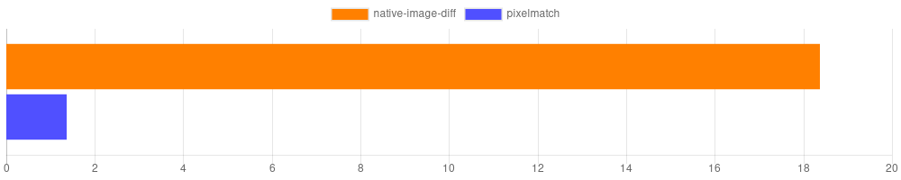

# native-image-diff

[](https://www.npmjs.com/package/native-image-diff)
[](https://travis-ci.org/Prior99/native-image-diff)
[](https://ci.appveyor.com/project/Prior99/native-image-diff/branch/master)
[](https://coveralls.io/github/Prior99/native-image-diff?branch=master)

A simple library for comparing two images using a native C++ binding. This library is highly inspired by the great [pixelmatch](https://github.com/mapbox/pixelmatch).
In fact, many parts of the algorithms are 1:1 C++ reimplementations.

Please also refer to the **[Documentation](https://prior99.github.io/native-image-diff/docs/index.html)**.

## Table of contents

 * [native-image-diff](#native-image-diff)
    * [Table of contents](#table-of-contents)
    * [Supported environments](#supported-environments)
    * [Usage](#usage)
        * [Basic example](#basic-example)
        * [Usage with node-libpng](#usage-with-node-libpng)
        * [The resulting values explained](#the-resulting-values-explained)
        * [Antialiasing Detection](#antialiasing-detection)
        * [Color threshold](#color-threshold)
    * [Benchmark](#benchmark)
    * [Contributing](#contributing)
    * [Contributors](#contributors)

## Supported environments

This is a native Addon to NodeJS which delivers prebuilt binaries. Only some environments are supported:

| Node Version      | Windows 64-Bit     | Windows 32-Bit     | Linux 64-Bit       | Linux 32-Bit | OSX                |
|-------------------|--------------------|--------------------|--------------------|--------------|--------------------|
| Earlier           | ✗                  | ✗                  | ✗                  | ✗            | ✗                  |
| Node 6 *(Abi 48)* | ✓                  | ✓                  | ✓                  | ✗            | ✓                  |
| Node 7 *(Abi 51)* | ✓                  | ✓                  | ✓                  | ✗            | ✓                  |
| Node 8 *(Abi 57)* | ✓                  | ✓                  | ✓                  | ✗            | ✓                  |
| Node 9 *(Abi 59)* | ✓                  | ✓                  | ✓                  | ✗            | ✓                  |

## Usage

More sophisticated, fully working examples can be found [here](example/):

 * [Simple example](example/src/simple.js)
 * [Antialiasing Detection](example/src/antialiasing-detection.js)
 * [Generate no diff image](example/src/no-diff-image.js)
 * [Color Threshold comparison](example/src/color-threshold.js)

### Basic example

A basic example of how to use this library can look like this:

```typescript
import { diffImages } from "native-image-diff";

// Somehow get buffers to an RGB or RGBA image.
const imageBuffer1 = Buffer.alloc(300);
const imageBuffer2 = Buffer.alloc(300);

const image1 = {
    data: imageBuffer1,
    width: 20,
    height: 5
};

const image2 = {
    data: imageBuffer2,
    width: 20,
    height: 5
};

const { image, pixels, totalDelta } = diffImages(image1, image2);
// `image` now containes the width and the height of an RGBA image
// visualizing the difference between `image1` and `image2`.
// `pixels` is the amount of pixels which didn't match.
// `totalDelta` is a relatively scaled number with higher values being
// the most different and `0` being total equal.
```

The two buffers in `image1` and `image2` are expected to contain an RGB or RGBA encoded 8bit image. In the above example an RGB image was used.

Both images will be compared pixel-per-pixel and the result as well as a visualization of the difference is returned.

This library does not provide any way to read or write images. Take a look at [usage with node-libpng](#usage-with-node-libpng) for an idea.

With these input images:

 

The generate diff image will look like this:



### Usage with node-libpng

This library is API-compatible with [node-libpng](https://www.npmjs.com/package/node-libpng). It's simple to use decoded images as well as encoding them:

```typescript
import { diffImages } from "native-image-diff";
import { readPngFileSync, writePngFileSync } from "node-libpng";

const { image, pixels } = diffImages(readPngFileSync("./image1.png"), readPngFileSync("./image2.png"));
console.log(`Compared both images. ${pixels} were different.`);

writePngFileSync("./diff.png", image.data, { width: image.width, height: image.height });
// In JS this can be even shorter: `writePngFileSync("./diff.png", image.data, image);`.
```

### The resulting values explained

A result might look like this:

```js
{
    pixels: 286,
    totalDelta: 3434604.5,
    image: {
        width: 100,
        height: 100,
        data: <Buffer 00 00 00 00 00 00 00 00 00 00 00 00 00 00 00 00 00 00 00 00 00 00 00 00 00 00 00 00 00 00 00 00 00 00 00 00 00 00 00 00 00 00 00 00 00 00 00 00 00 00 ... >
    }
}
```

#### pixels

This represents the total amount of pixels differing between both images.

#### totalDelta

This is the summed up total perceived difference of all pixels. It grows with the color difference of every unmatched pixel.

In comparison to the [pixels](https://prior99.github.io/native-image-diff/docs/interfaces/diffresult.html#pixels) property this property also represents how different all colors were. Comparing a white image
with a black image would yield a higher difference as comparing an orange with a red image.

It doesn't feature any specific unit and should be used for relative comparisons only.

#### image

This property is only generate if [generateDiffImage](https://prior99.github.io/native-image-diff/docs/interfaces/diffimagesarguments.html#generatediffimage) is set to `true` (default).

It's properties `width` and `height` represent the dimensions of the generated image in pixels and `data` holds a RGBA buffer
of raw image data showing the visual difference between both input images. Different pixels are drawn in red and pixels which
only differed between both images because of antialiasing will be drawn in yellow. This is only true if [detectAntialiasing](https://prior99.github.io/native-image-diff/docs/interfaces/diffimagesarguments.html#detectantialiasing)
is set to `true` (default).

### Antialiasing Detection

By default this library will try to detect whether a pixel was part of antialiasing and ignore the respective change.
This works ~90% of the time:

These images (one with and one without antialiasing):

 

Will look like this with detection enabled:



The yellow pixels represent detected antialiasing will not be included in the [pixels](https://prior99.github.io/native-image-diff/docs/interfaces/diffresult.html#pixels)
property of the result.

And like this with detection disabled:


Disable the detection by providing `false` as [detectAntialiasing](https://prior99.github.io/native-image-diff/docs/interfaces/diffimagesarguments.html#detectantialiasing).

### Color threshold

It's possible to specify a different [colorThreshold](https://prior99.github.io/native-image-diff/docs/interfaces/diffimagesarguments.html#colorthreshold).

The color threshold ranges from `0` to `1` with `1` permitting all changes and `0` permitting none.
It influences the allowed per-pixel color difference.

The following example shows the visual difference between a gradient and a red rectangle with different thresholds:

Input images:

 

Thresholds from 0.0 to 0.7:

*0.0: (2826 pixels different)*



*0.1: (2413 pixels different)*


*0.2: (1986 pixels different)*


*0.3: (1570 pixels different)*


*0.4: (1142 pixels different)*


*0.5: (731 pixels different)*


*0.6: (300 pixels different)*



*0.7: (0 pixels different)*


## Benchmark

As it is a native addon, **native-image-diff** is much faster than [pixelmatch](https://github.com/mapbox/pixelmatch):

The chart below shows the comparison of comparing an 512x512 pixel image between [pixelmatch](https://github.com/mapbox/pixelmatch) and **native-image-diff**.
The operations per second are displayed (Higher is better).



*(The x-axis scale shows the amount of diffed images per second.)*

## Contributing

Yarn is used instead of npm, so make sure it is installed, probably: `npm install -g yarn`.

Generally, it should be enough to just run:

```
make
```

which will install all node dependencies and compile the C++ code,
compile typescript, execute all test, lint the sources and build the docs.

## Contributors

 - Alexander Dmitriev
 - Frederick Gnodtke
